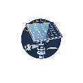

<picture align="center">
  <source media="(prefers-color-scheme: dark)" srcset="doc_utili/img/girasole2.png">
  
</picture>

# Divari - Il pannello girasole
## Un pannello solare che insegue il sole
Sfruttando i sensori di luminosità manipolare la rotazione di un servomotore
per simulare la rotazione di un pannello solare. In realtà secondo il progetto 
da me ideato, il pannello gira grazie al servomotore...
Ebbene per iniziare a lavorare in modo adeguato su questo progetto vi propongo 
la visione di alcuni video. 
