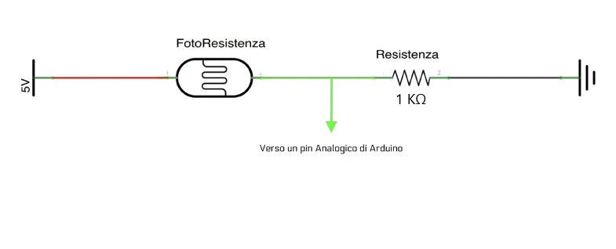

 IL SOLE E' DI CHI LO SEGUE
--------------------------------------
# Divari - Il pannello girasole
## Un pannello solare che insegue il sole

Sfruttando i sensori di luminosità manipolare la rotazione di un servomotore
per simulare la rotazione di un pannello solare. In realtà secondo il progetto 
da me ideato, il pannello gira grazie al servomotore...
Ebbene per iniziare a lavorare in modo adeguato su questo progetto vi propongo 
la visione di alcuni video. 

--------------------------------------
## Progetto diviso in più fasi:

 - [Fase1](#Fase1): studiamo il funzionamento di un partitore di tensione per la fotoresistenza;
 - [Fase2](#Fase2): studiamo il funzionamento di un servomotore per il movimento del pannello.

## Fase1
### Come utilizzare una fotoresistenza


<br>Il partitore ci permette di leggere il valore restituito dalla foto resistenza.
Caratteristiche tecniche:
```
Restitenza: 1k
Alimentazione: 5v sul capo libero della foto resistenza
Negativo: sul capo libero della resistenza
Per la lettura: pin analogico collegato all'incrocio tra fotoresistenza e resistenza.
```
## Fase2
### Cos'è un servomotore
